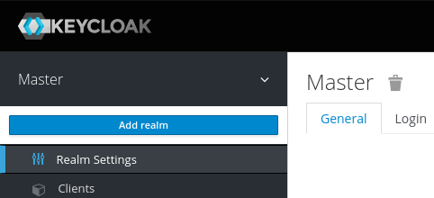
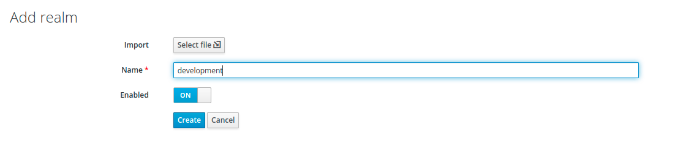
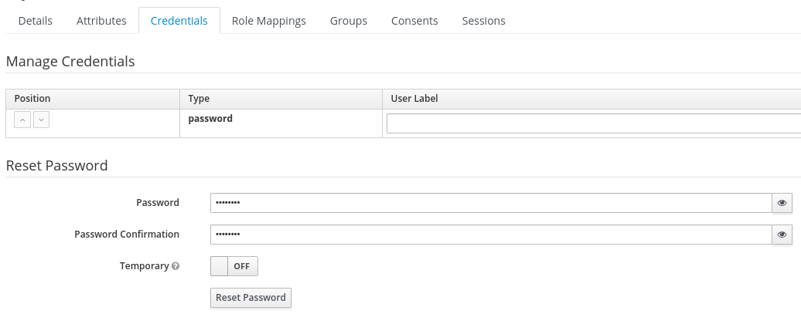
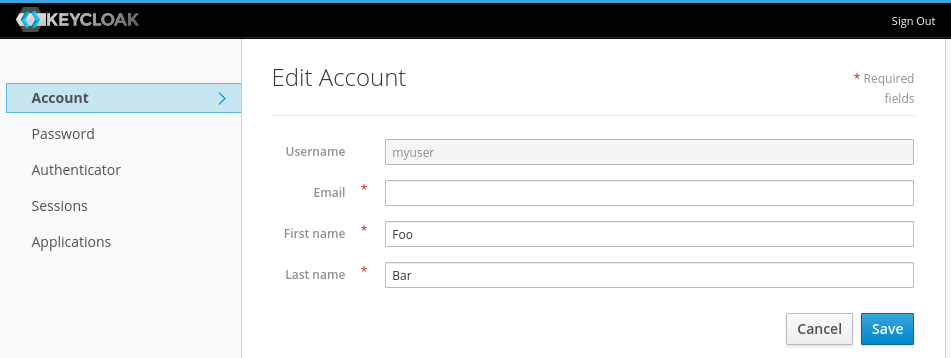
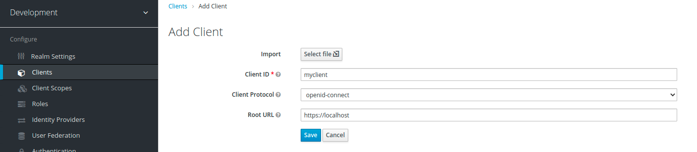
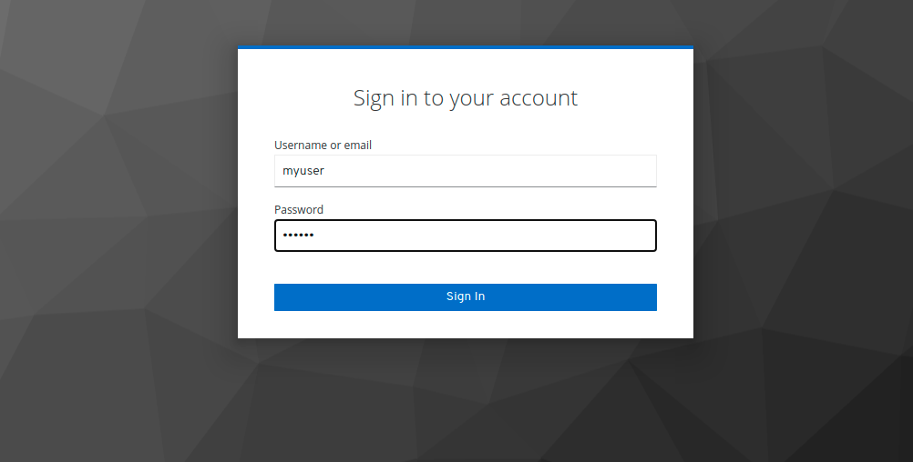

# Build Keycloak docker

```docker
docker build -t keycloak:latest .
```

# Start Keycloak
From a terminal start Keycloak with the following command:

```docker
docker run -d -p 8080:8080  -e KEYCLOAK_USER=admin -e KEYCLOAK_PASSWORD=admin keycloak:latest
```

This will start Keycloak exposed on the local port 8080. It will also create an initial admin user with username admin and password admin.


# Login to the admin console
Go to the Keycloak Admin Console and login with the username and password you created earlier.

# Create a realm
A realm in Keycloak is the equivalent of a tenant. It allows creating isolated groups of applications and users. By default there is a single realm in Keycloak called master. This is dedicated to manage Keycloak and should not be used for your own applications.

Let’s create our first realm.

1. Open the Keycloak Admin Console

2. Hover the mouse over the dropdown in the top-left corner where it says Master, then click on Add realm

3. Fill in the form with the following values:

    * Name: development

4. Click Create




# Create a user
Initially there are no users in a new realm, so let’s create one:

1. Open the Keycloak Admin Console

2. Click Users (left-hand menu)

    * Click Add user (top-right corner of table)

3. Fill in the form with the following values:

    * Username: myuser

    * First Name: Your first name

    * Last Name: Your last name

4. Click Save


The user will need an initial password set to be able to login. To do this:

1. Click Credentials (top of the page)

2. Fill in the Set Password form with a password

3. Click ON next to Temporary to prevent having to update password on first login




# Login to account console
Let’s now try to login to the account console to verify the user is configured correctly.

1. Open the Keycloak Account Console

2. Login with myuser and the password you created earlier

You should now be logged-in to the account console where users can manage their accounts.

account-console



# Secure your first app
Let’s try to secure our first application. First step is to register this application with your Keycloak instance:

1. Open the Keycloak Admin Console

2. Click 'Clients'

3. Fill in the form with the following values:

    - Client ID: myclient

    - Client Protocol: openid-connect

    - Root URL: https://localhost

```Root URL (redirect URL)```

4. Click Save




# Login with your app
Let's now add the basic configuration in your app - let's pretend we have a angular app:

```json
KeycloakConfig = {
  url: 'http://localhost:8080/auth',
  realm: 'development',
  clientId: 'myclient'
};
```

## Login with myuser and the password you created earlier


